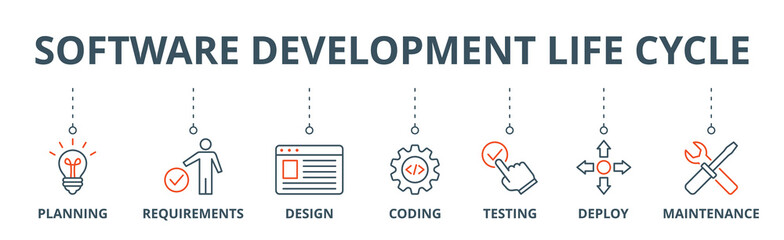

## Hi there, This is Yash Ahmad 👋

```
👨‍💻 I’m currently working as Full Stack Software Engineer.

📖 I’m currently learning Web3.0, Artificial Intelligence, Machine Learning, Distributed Systems, CyberSecurity.

🛠️ I’m always looking to collaborate with any startup or ic for challenging tech problems.

💬 Ask me about, Full Stack Web Development, Mobile App Development, SEO and Software Development.

📫 Reach me out on Discord

🌐 Below is my skillset, adding more soon.
```

### Languages
           

### Frontend Technologies
        

### Backend Technologies
    

### Databases
        

### Devops
        

### Cloud
      

### Design Tools
  